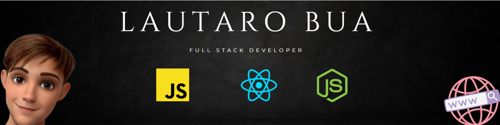

  

# Sobre Mi...🙋‍♂️​
Hola red!, mi nombre es Lautaro, soy un desarrollador web full stack con preferencia en el back-end. Me considero una persona dedicada, proactiva y responsable, a quien le encanta trabajar en equipo, plantearse nuevos desafios y aprender día a día.

Estoy convencido de que la gente que avanza es la gente que se esfuerza. 💪​

# Habilidades Técnicas ​🛠️​

  
  <
  <
  <
  
  <
  <
  <
  <
  <
  <
  <

# Mis Proyectos 💼​

<a href="https://salva-mi-huella.vercel.app/" target="_blank"><h2>Salva Mi Huella</h2></a>

"SALVA MI HUELLA" es una aplicación web que tiene como objetivo principal vencer la superpoblación, y abandono que sufren millones de animales en nuestro país promoviendo la adopción de animales y consiguiendoles un hogar para que se encargan de su cuidado. Se utilizó el lenguaje Javascript junto con React para el Front End y Redux como gestión de estado. El Back End se desarrolló en Node.JS utilizando Express y por último como base de datos PostgresSQL. Como base para la organización del grupo se utilizó la metodología SCRUM y la tecnología Trello.

Algunas funcionalidades que contiene la página:
- Integración de PayPal para hacer donaciones a refugios directamente desde la app.
- Integración de Auth0 para implementaciones de inicio de sesión y roles para usuarios, refugios y perfiles de administradores.
- Google Maps.

<a href="https://github.com/Lauti0122/Video_Games_PI" target="_blank"><h2>Videogames APP</h2></a>

 "VIDEOGAMES" es una single application web con fines educativos realizada como proyecto individual en el bootcamp de Henry. Se montó la app en Javascript junto con React para el Front End y Redux como gestión de estado. El Back End se desarrolló en Node.JS utilizando Express, consumiendo una API externa con sus respectivos end-points para traer información sobre los videojuegos, y por último como base de datos PostgresSQL para guardar estos datos.

Algunas funcionalidades que contiene la página:
- Integración de Auth0 para implementaciones de inicio de sesión.
- Variedad de filtros para los videojuegos.
- Formulario para crear tus propios juegos.

# Para contactarme 📞​

